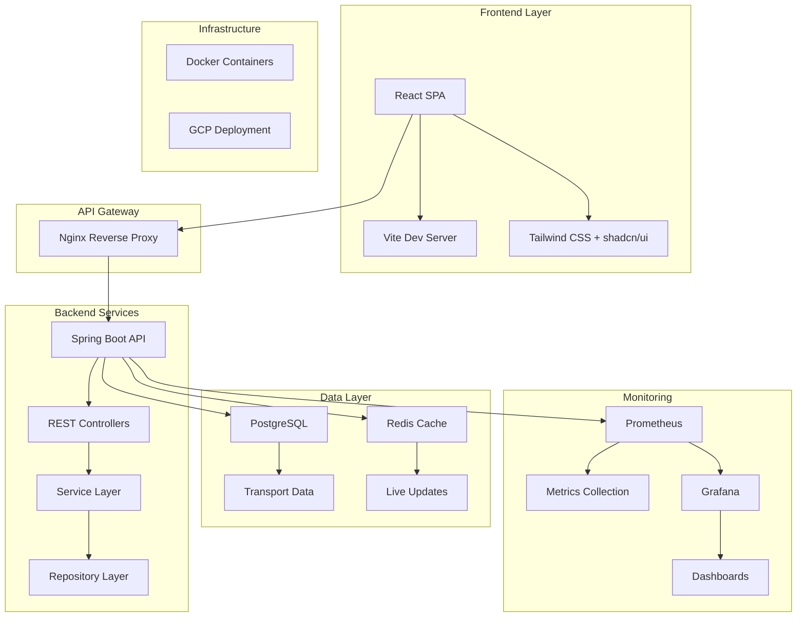
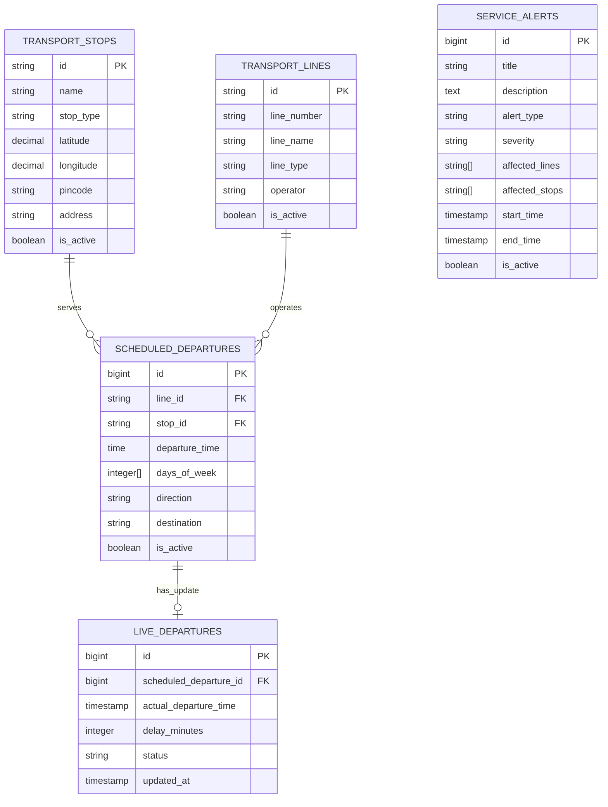
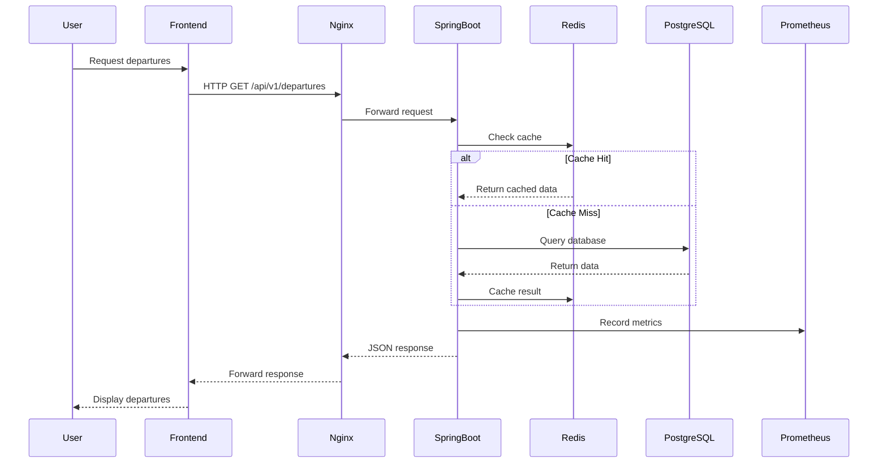

# LiveLink Ludwigsburg - Project Presentation

## 🚀 Motivation
*[Please provide your specific motivation for building this system]*

- Real-time public transport information needs
- Improving commuter experience in Ludwigsburg
- Modern, responsive web application for transport data

## 🎯 Problem Statement
*[Please elaborate on the specific problems you identified]*

- Lack of centralized, real-time transport information
- Outdated or fragmented transport data access
- Need for mobile-friendly transport planning tools

## 👥 Target Group
*[Please specify your primary target users]*

- Daily commuters in Ludwigsburg region
- Public transport users seeking real-time information
- Mobile-first users requiring quick departure updates

---

## 🏗️ Technical Architecture

### System Overview

### Frontend Architecture
- **Framework**: React 18 with TypeScript
- **Build Tool**: Vite for fast development and optimized builds
- **Styling**: Tailwind CSS with custom design system
- **UI Components**: shadcn/ui component library
- **State Management**: React Query for server state
- **Routing**: React Router DOM

### Backend Architecture
- **Framework**: Spring Boot 3.x with Java 17
- **Architecture Pattern**: Layered Architecture
  - **Controller Layer**: REST API endpoints
  - **Service Layer**: Business logic
  - **Repository Layer**: Data access
- **Build Tool**: Maven for dependency management
- **API Design**: RESTful API following RMM Level 2

### Database Architecture

---

## 🔧 Technology Stack

### Frontend Stack
- **React 18**: Modern component-based UI framework
- **TypeScript**: Type-safe JavaScript for better development experience
- **Vite**: Fast build tool with HMR
- **Tailwind CSS**: Utility-first CSS framework
- **shadcn/ui**: High-quality, accessible UI components
- **React Query**: Powerful data fetching and caching
- **React Router**: Client-side routing
- **Lucide React**: Beautiful icons

### Backend Stack
- **Spring Boot 3.x**: Enterprise-grade Java framework
- **Java 17**: Latest LTS version with modern features
- **Maven**: Dependency management and build automation
- **Spring Data JPA**: Database access layer
- **Spring Web**: RESTful web services
- **Spring Cache**: Caching abstraction
- **Spring Actuator**: Production monitoring

### Database & Persistence
- **PostgreSQL**: Robust relational database
- **Redis**: In-memory caching for live updates
- **JDBC Template**: Direct SQL query execution
- **Connection Pooling**: Efficient database connections

### DevOps & Infrastructure
- **Docker**: Containerization for all services
- **Docker Compose**: Multi-container orchestration
- **Nginx**: Reverse proxy and load balancer
- **Prometheus**: Metrics collection and monitoring
- **Grafana**: Monitoring dashboards and alerting
- **Google Cloud Platform**: Production deployment
  - *[Please specify which GCP services you used]*

---

## 🔄 Component Interactions

### API Request Flow

### Key API Endpoints
- `GET /api/v1/departures?pincode={pincode}` - Get departures by area
- `GET /api/v1/departures/stop/{stopId}` - Get departures for specific stop
- `POST /api/v1/departures/live` - Get live departure updates
- `GET /api/v1/alerts` - Get active service alerts
- `GET /api/v1/stops/search?q={query}` - Search transport stops

### Data Flow Architecture
1. **Scheduled Data**: Static timetable data stored in PostgreSQL
2. **Live Updates**: Real-time departure changes cached in Redis
3. **Service Alerts**: Dynamic service disruption information
4. **Monitoring**: All interactions tracked via Prometheus metrics

---

## ⚠️ Open Issues & Limitations
*[Please provide your current challenges and known issues]*

### Technical Challenges
- [Add your specific technical issues]
- [Performance bottlenecks]
- [Scalability concerns]

### Feature Gaps
- [Missing functionality]
- [User experience improvements needed]

### Infrastructure Limitations
- [Deployment challenges]
- [Monitoring gaps]

---

## 📊 Summary

### Project Achievements
- ✅ **Full-stack Application**: Modern React frontend with Spring Boot backend
- ✅ **Real-time Data**: Live departure updates with caching
- ✅ **Responsive Design**: Mobile-first UI with beautiful components
- ✅ **Production Ready**: Docker containerization and GCP deployment
- ✅ **Monitoring**: Comprehensive metrics with Prometheus/Grafana
- ✅ **Database Design**: Well-structured relational data model

### Technical Highlights
- **Architecture**: Clean layered architecture with separation of concerns
- **Performance**: Redis caching for optimal response times
- **Scalability**: Containerized services ready for horizontal scaling
- **Maintainability**: TypeScript and strong typing throughout
- **Monitoring**: Production-grade observability stack

### Key Metrics
- **API Endpoints**: 8+ RESTful endpoints
- **Database Tables**: 5 core entities with relationships
- **Frontend Components**: 10+ reusable UI components
- **Test Coverage**: Unit and integration tests *[specify coverage]*
- **Deployment**: Multi-environment Docker setup

### Future Roadmap
- Enhanced real-time features
- Mobile app development
- Advanced analytics
- Performance optimizations
- Extended transport coverage

---

*This presentation showcases a production-ready public transport information system built with modern technologies and best practices.*